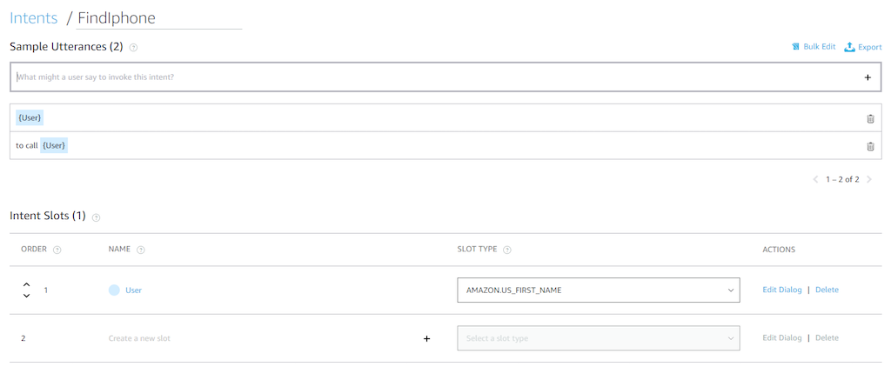

# Alexa Find My iPhone
This is an Amazon Echo skill that will use the "find my iPhone" feature of
iCloud to find your iPhone.

Most of the magic is done by
[pyicloud](https://github.com/picklepete/pyicloud).

# iCloud Two Factor Auth (2FA)
At this time Apple allows us to use Find My iPhone without 2FA confirmation,
so this skill will work if you have 2FA enabled.

## Python Version
This was developed against Python 3.6.7. 
Checkout the `py2` branch for the old Python 2 version.

## Hosting
You'll need to host this project on your own server. Alexa will connect to your
server over HTTPS. HTTPS is a hard requirement per Amazon. If you need an SSL
certificate, [Let's Encrypt](https://letsencrypt.org/) can provide you one for
free (there's no catch, this isn't an ad).

### AWS Lambda
If you are not comfortable with setting up your own server or don't have the
resources/time, [timtrinidad has ported this code](https://github.com/timtrinidad/alexa-findmyiphone) to work with AWS Lambda. I
haven't personally tested it, but it looks ok from here (This is the old py2 
version).

### WSGI - Apache/NGINX/uWSGI/etc.
This skill is written in Python with the Bottle web framework. The app is a
wsgi application. I have only used Apache's `mod_wsgi` personally, but it
should be somewhat universal. Google for how to use wsgi with your webserver if
you're unsure.

#### Generic instructions
1. Clone or copy this repository somewhere e.g. `/opt/alexa-findmyiphone`.
1. `cd` to your installed directory `cd /opt/alexa-findmyiphone`.
1. Create a virtual environment in a directory named "venv":
   `virtualenv -p python3 venv`. If you don't have the `virtualenv` command,
   install it from pip: `pip install virtualenv`. If you don't have pip, use
   your package manager to get it e.g. `sudo apt-get install python-pip`.
1. Activate the virtualenv: `source venv/bin/activate`.
1. Install requirements `pip install -r requirements.txt`.
1. Fix up any permissions as needed.
1. Configure your users. See the "User Config" section for details.

#### Apache
These instructions are for Apache on Ubuntu, but it should be fairly standard
for other systems.

1. Install Apache and Apache's mod_wsgi:
   `sudo apt-get install -y apache2 libapache2-mod-wsgi`.
1. Enable the module: `a2enmod wsgi`.
1. Follow the generic instructions above, but put the repo in
   `/var/www/alexa-findmyiphone`.

##### Apache Virtual Host
I created a virtual host entry as I used a subdomain for this skill.
I also setup a [Let's Encrypt](https://letsencrypt.org/) SSL certificate for
this subdomain. I won't explain how to do that as their website would have more
up-to-date information anyways.

This goes in `/etc/apache2/sites-enabled/000-default.conf` or what have you.

```
<VirtualHost *:443>
  ServerName iphone.example.com

  SSLEngine on
  SSLCertificateFile      /etc/letsencrypt/live/iphone.example.com/cert.pem
  SSLCertificateKeyFile   /etc/letsencrypt/live/iphone.example.com/privkey.pem
  SSLCertificateChainFile /etc/letsencrypt/live/iphone.example.com/chain.pem

  <Location />
    Order allow,deny
    Allow from all
  </Location>

  WSGIDaemonProcess alexa-findmyiphone user=www-data group=www-data processes=1 threads=5
  WSGIScriptAlias / /var/www/alexa-findmyiphone/app.wsgi

  <Directory /var/www/alexa-findmyiphone>
    WSGIProcessGroup alexa-findmyiphone
    WSGIApplicationGroup %{GLOBAL}
    Order deny,allow
    Allow from all
  </Directory>

  ErrorLog ${APACHE_LOG_DIR}/error_iphone.log
  CustomLog ${APACHE_LOG_DIR}/access_iphone.log combined
</VirtualHost>
```

Now restart Apache and you should be good `sudo service apache2 restart` or
`sudo systemctl restart apache2`.

## Config on Amazon's end

1. Open your
[Alexa Developer Console](https://developer.amazon.com/alexa/console/ask) and
login with the same account you use for your Echo/Alexa.
I can't remember if I had to link the accounts or how it actually worked, but
you want the same account that your echo uses so you don't actually have to
release this skill to the public.

1. Name your skill (the name doesn't matter, but mine is "FindMyiPhone") and
   specify that it is a "custom" skill (so no template)

1. Then select "start from scratch" (again, so no template).

1. You should now be in the console for your custom skill. Click on
   "Invocation" on the left navigation. My invocation name is "find my iphone".
   The invocation name is what you'll say to Alexa to let her know you want to
   use this skill. Make sure to click "Save Model" at the top of each page as
   you go.

1. Now click on "Intents" in the left navigation pane. You should see 5
   "required" intents that already exist. Ignore these and click "Add intent".

1. The name for the intent does not matter, but mine is named "FindIphone".
   What is important however, is the sample utterances. I like to say to Alexa:
   "Alexa, tell find my iphone Dennis". Which would mean to find Dennis'
   iPhone. If you want to look at that sentence tokenized, it's `{wake: Alexa}
   tell {invocation: find my iphone} {intent: Dennis}".

1. To make this intent work, I need only the user who has lost their phone,
   because of this my sample utterance is simply `{User}` (because "Alexa, tell
   find my iPhone" is the invocation and has already been said by the time we
   get to our intent). Then click the plus on the right to add it. The curly
   brace creates a slot below. We'll refine the slot in a moment. I also have a
   second utterance `to call {User}`, which would be used like: "Alexa, tell
   find my iphone to call Dennis". I've never actually used this one in the
   wild as it's longer and I'm lazy, but it gives you examples of how this
   might work.

1. Now under Intent Slots, you should see the `User` slot we created. You have
   to set what types of words Alexa should expect from that slot type. I use
   `AMAZON.US_FIRST_NAME`.

   

1. Once you're done, remember to click save. At this point you should also be
   able to build the model (button at the top of the page).

1. The final thing to do is setup the endpoint. If you're using AWS Lambda,
   here is where you would select your instance. I'm self hosting so I select
   HTTPS. You need only specify the URL for the "Default Region". Let's Encrypt
   is a trusted certificate authority, so I selected that option. And save.

1. Then go to the "Test" tab via the top nav bar, and enable testing for the
   skill. Ensure everything works. This is the best place to debug.

### Test with curl
On the testing page, you would use the Alexa Simulator and enter something like
"tell find my iphone John" into the box, where John is your name. This can get
old fast, so here's how to test with curl.

Use the following example JSON and save it to a file named
`sample_request.json`. You'll want to change "John" to a user that is actually
configured in your `users.py` file.

```json
{
  "request": {
    "intent": {
      "name": "FindIphone",
      "slots": {
        "User": {
          "value": "John"
        }
      }
    }
  }
}
```

Then run the following command:
```
curl -vX POST https://iphone.example.com -d @sample_request.json --header 'Content-type: application/json'
```

## User Config

Copy `users.example.py` to `users.py` to configure users' iCloud accounts.
There is a `USERS` dictionary where each key is the name of the user, and each
value is a tuple of iCloud username and password. The name of the user is
what you'll say to Alexa when you say, "find my iphone `NAME`".

## Need Help?

If you need help, please feel free to open an issue.

## License
Code licensed under the unlicense. View `LICENSE.txt` for more information.

TL;DR; Code is public domain.
